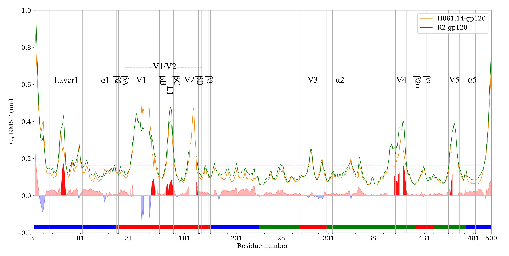

# dynamics, thermodynamics and kinetic of gp120

## sensitivity
Insights into the molecular mechanism underlying CD4-dependency and neutralization sensitivity of HIV-1: a comparative molecular dynamics study on gp120s from isolates with different phenotypes

